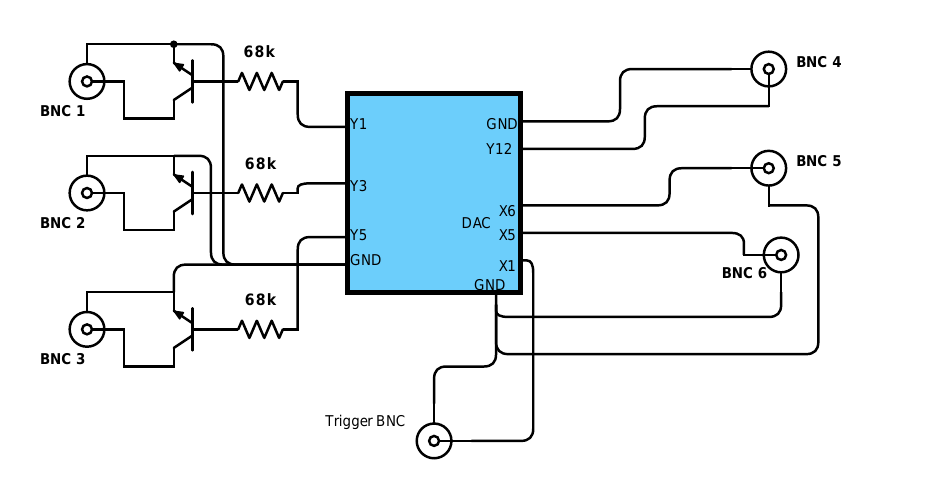

.. _pyboard:

=======
Pyboard
=======

.. _cosplayer:

COSplayer - A Reproducible Device
==================================

COSplay is designed for and tested on a pyboard-based device with specific input and output capabilities.
We refer to this device as a COSplayer.
While the software needs no additional hardware other than the pyboard itself in order to function, trigger delivery to the pyboard, as well as usage of output signals is only feasible given additional components.
Here we provide instructions on how to reproduce a second-generation COSplayer (usable with COSplay `commit 76db2a9 <https://github.com/IBT-FMI/COSplay/commit/76db2a945aab5add3988f7be122372c400808396>`_ and newer).
A (more cursory) description of the first-generation device can be found in the documentation of older versions.

Assembly
--------

Given the components listed below, we provide a fully narrated video tutorial of how to assemble the device:

.. raw:: html
    
    

    <iframe src="https://widgets.figshare.com/articles/7227626/embed?show_title=0" width="568" height="426" frameborder="0"></iframe>
    

Components
----------

To reproduce the COSplayer you will need:

* A MicroPython pyboard v1.1 (without headers and with firmware version 1.9.1).
* 7 BNC connectors (female).
* 2 general purpose small-signal transistors (e.g. 2N3904).
* 2 resistors (68 kiloohm).
* 2 resistors (10 kiloohm).
* Stripboard (18x4 section or larger).
* Connector cables.

Optionally, we recommend procuring:

* Case, with a configuration permitting the drilling of holes to accommodate circuit inputs/outputs.
* A small print-out flowchart with LED pattern legend, for usage-guide-independent operation.

Lastly, if the device is intended for frequent manual circuit configuration (i.e. you are interested in further developing the device rather than just using it), we recommend performing all the circuit connections via:

* Separate header connectors (2.54mm, female).

Circuit
-------

The following figure shows the circuit used with the pyboard.
BNC ports 1 and 2 can short circuit the incoming BNC.
Ports 3 and 4 can deliver ~4.2V TTL pulses.
Ports 5 and 6 allow changing the amplitude of a TTL pusle (max. ~3.3V).
Exact output values depend on the input voltage of the USB port. 

*NOTE:* The maximum output voltage of the amplitude modulation pins depends on output impedance and the resistive load.
If this poses difficulties, we suggest enabling the optional analogue buffer on the DAC in the MicroPython firmware (cf `commit 94d2127 <https://github.com/IBT-FMI/micropython/commit/94d21272e2f3f0d4d33c4b80c9a7b8e3816452ee>`_ on our micropython fork).
The buffer offers lower output impedance, but reduces the output accuracy in turn.

LED Pattern Legend
==================

.. graphviz:: workflow.dot

Green, orange and blue:
    Pyboard tries to connect to software on the host computer.

Blue:
    Copy mode.

Orange:
    Pyboard is armed.

Green:
    Delivering sequence.

Green, Blue:
    Stimulus active.

Red:
    Computer writes to filesystem of pyboard.
    Warning! Do not unplug or reset the board in this state as files might be corrupted.

Red/Green flashing:
    An error occured while executing the scripts on the board.

Standalone use
==============

The pyboard can also be used without COSplay on the host computer.
To select this usage mode press the 'USR' button on the board, when the green, orange, and blue LEDs light up simultaneously after the board started.

To load sequences onto the pyboard you need to enter the copy mode.
Double click the 'USR' button, when the green, orange, and blue LEDs light up simultaneously after the board started.
The board should now present itself to the computer as a mass storage device, and the blue LED should light up.
Copy the sequence files into the ``sequence_library`` folder on the board or SD card.

*NOTE:* Do not forget to safely remove or unmount the board before restarting or disconnecting it --- unlike a normal memory stick, you are using this device as part of a timed scientific experiment, which may be delayed or inevitably compromised by corrupted memory.

The board can be restarted by pressing the 'RST' button.

Delivered sequences will be stored in
``delivered_sequences/sequencesX/sequenceY.tsv``, where ``X`` and ``Y``
are numbers. A new folder ``delivered_sequences/sequencesX`` is created
for every reboot of the pyboard.

*NOTE:* You have to delete old sequences manually.

Sequence Errors
===============

Before deliverying a sequence, the board checks its consistency.
If the period is smaller than the pulse width or the values in the out_channel column are not integers between 1 and 6, a SequenceError is raised.

In case the board misses a scheduled onset time or end time of a pulse,
an error message is displayed. Furthermore, all error messages are stored
in a file ``errors.txt`` in the same directory as ``sequence.tsv``.

If the board is operated in :math:`\mu s` accuracy mode, the earliest possible onset time for the first event is approximately :math:`320\mu s` due to computational overhead.
For smaller onset times, the board inevitably misses the scheduled event, and reports the incident as described above.
In :math:`ms` mode this delay is negligible.

Runtime Errors
==============

For debugging purposes, exceptions are stored in ``exceptions.txt`` on
the board.

*NOTE:* Syntax errors are not handled, as they are raised before execution.
You can use a programme like 'screen', 'minicom' or 'picocom' to debug syntax errors.

config.py
=========

Library path
------------

If one copies sequences to the board manually, the path to the directory containing the sequences can be spcified in ``library_path``.

Accuracy
--------

``accuracy`` can be 'us' for :math:`\mu s`-mode or 'ms' for :math:`ms`-mode.

On values for out channels
--------------------------

The values in this section are the values a pin takes when a stimulus is delivered.
If no stimulus is to be delivered, the pin takes the oposite value.
